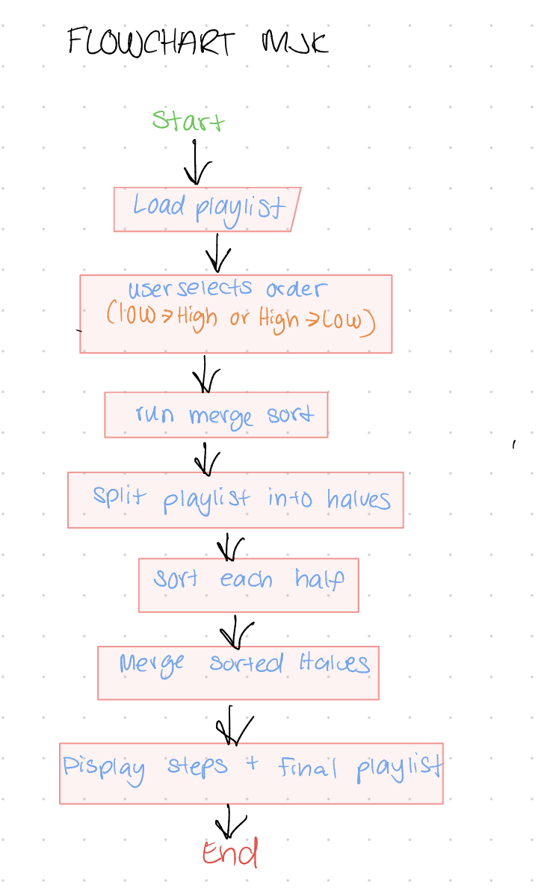

# Playlist Vibe Sorter by Marie-Jocelynne Kasiama for CISC 121 (Vizualization) ⋆˚꩜｡

## Chosen Problem ﹒☆﹒
I created a playlist sorter that organizes songs based on their energy level. The user can choose the sorting order (low to high or high to low) using a dropdown menu, making the app interactive. This shows how a sorting algorithm can be applied in a real-life situation like music playlists.

## Chosen Algorithm ﹒☆﹒
I used Merge Sort because it is efficient and works by splitting the list into smaller parts, sorting them, and merging them back together. Its also easy to visualize step-by-step, which makes it a good fit for showing the sorting process in the app.

## Demo Video (screenshot kinda) ﹒☆﹒

## Flowchart

## Problem Breakdown & Computational Thinking ﹒☆﹒

### Decomposition
- Take the playlist of songs with energy values
- Allow the user to choose sorting order (low -> high or high -> low)
- Split the playlist into smaller lists using Merge Sort
- Sort each part based on the selected order
- Merge the lists back together
- Display both the steps and final sorted playlist

### Pattern Recognition
- Repeatedy splitting lists into halves
- Compare song energy values
- Merge sorted sublists in the correct order
- Applying the same logic regardless of sorting direction

### Abstraction
- Only show song titles in sorting steps to keep it readable
- Hide implementation details like indexes and pointers
- Let the user interact using a simple dropdown instead of code
- Focus only on energy values for sorting

### Algorithm Design
Input -> playlist + selected sorting order  
Process -> merge sort based on energy value  
Output -> sorted playlist + step-by-step breakdown  

## Steps to Run
1. Install gradio:
2. Run the app: python3 app.py
3. Open the local URL shown in the terminal (usually http://127.0.0.1:7860)

## Testing ﹒☆﹒

### Test 1 (Normal case)
Expected: playlist sorted correctly based on selected order  
Actual: songs sorted correctly (both low→high and high→low)

### Test 2 (Already sorted)
Expected: minimal changes  
Actual: output remains correctly ordered

### Test 3 (Small dataset)
Expected: still sorts correctly  
Actual: works properly

## Input Handling

The app uses a predefined playlist, so an invalid user input is limited. Additoonally, the only user input is the sorting order, which is controlled through a dropdown menu, which prevents invalid input and ensures the program runs correctly.

## Hugging Face Link ･ᴗ･
https://huggingface.co/spaces/mariejoce/Playlist-Vibe-Sorter-MJK

__

## AI Disclosure ﹒☆﹒

